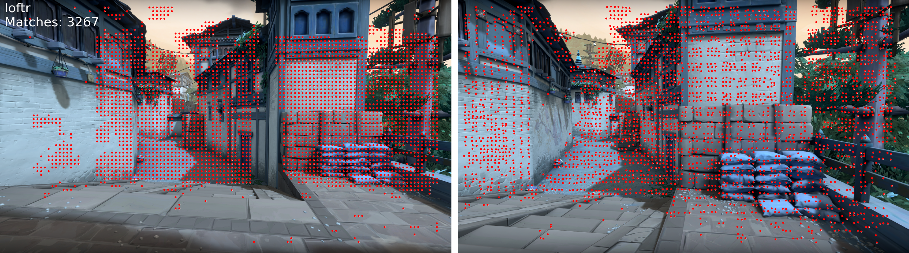
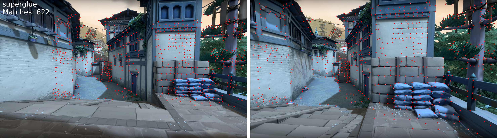
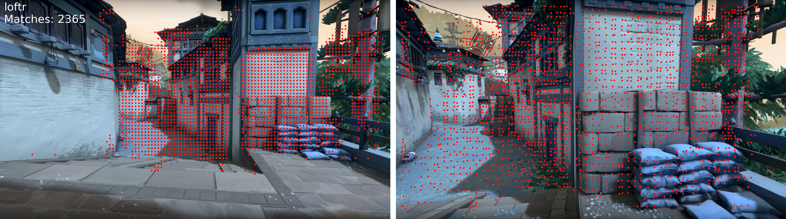
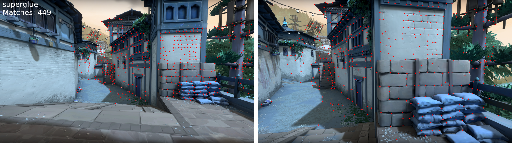
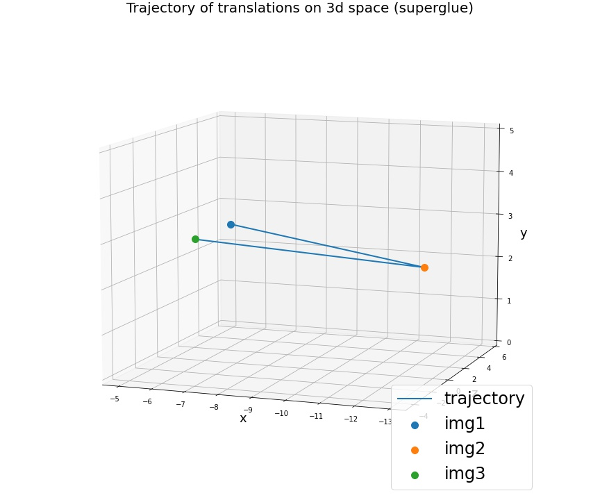
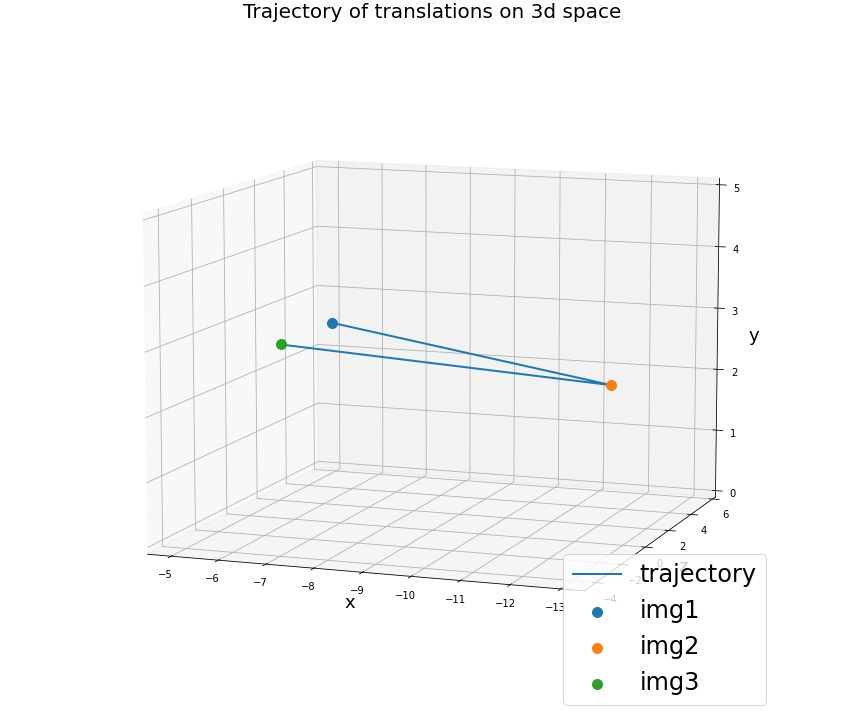
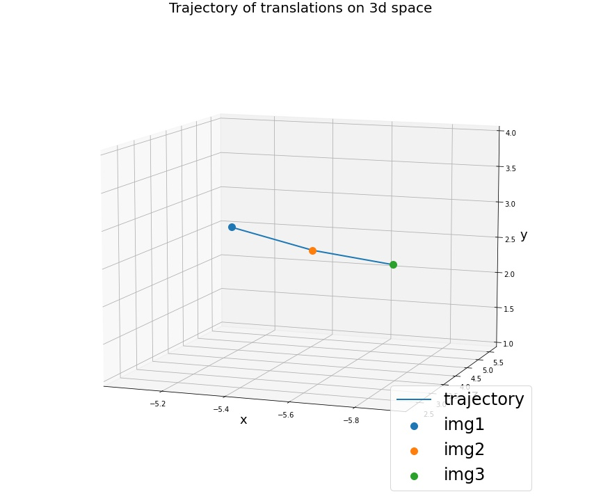

# 6DoF-camera-pose
The aim of this task is to find 6Dof pose of camera in images img2 and img3 w.r.t. pose in reference image img1.

My solution to this case is following these steps: 
1. Initially the camera is calibrated using calibrateCamera function and obtained calibrated cameraMatrix.
2. Extracted features from images using sota local feature extractor and matcher models such as LoFTR and SuperGlue.
3. EssentialMatrix estimated with matched keypoints.
4. Relative pose of camera estimated using recoveryPose with EssentialMatrix.
5. Relative pose scaled and visualized the trajectory.

LoFTR: https://arxiv.org/abs/2104.00680
SuperGlue: https://arxiv.org/abs/1911.11763

img1 -> img2

img1 -> img3

There are 2 different alternative solutions are also implemented in this work. 

First alternative solution:
1. Same with original solution but features are extracted with SIFT.

Second alternative solution:
1. Calibrated camera and obtained camera intrinsic matrix.
2. Calculated flow of vr2d points on target image with Lucas-Kanade Optical Flow algorithm.
3. Solved Pnp on target image with projected 2D - 3D correspondences to find the pose.
4. Visualized the trajectory.

